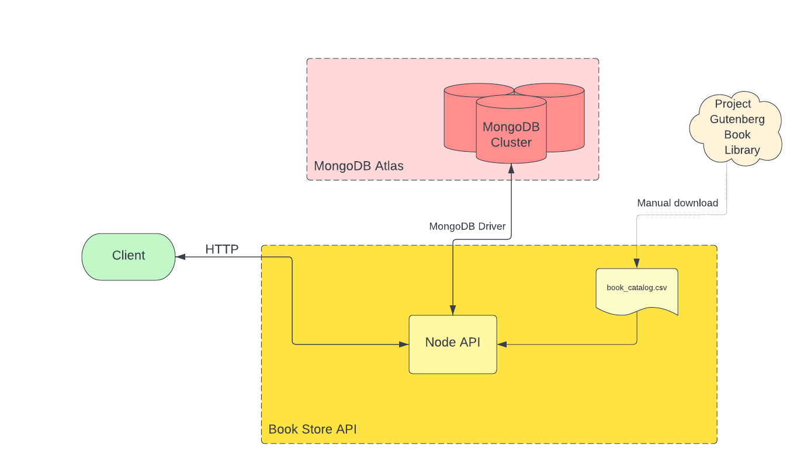

# Gutenberg Fiction Books API

## Introduction
Welcome to the gutenberg-fiction-books API, an API for fiction book lover. The purpose of this API is to get 20000+ fiction books available on [Project Gutenberg's Website](https://www.gutenberg.org/). 

## Architecture and code
The API is written in JavaScript (NodeJS) and uses ExpressJS to resolve API routes. The book data is stored in a MongoDB database and uses pagination to resolve queries.

## Documentation
### Base URL
https://gutenberg-fiction-books-api.cyclic.app  - Does not accept requests

### Endpoints
#### Endpoint 1
`/books`
Due to pagination, this is the first 20 books, ordered by the order_id field.

##### Request
`GET /books`

##### Sample Request
`GET https://gutenberg-fiction-books-api.cyclic.app/books`

##### Response
Returns the books in JSON format

##### Sample Response

  <pre>
  <code>
[
    {
        "download_link": {
            "html": "http://www.gutenberg.org/ebooks/11.html.noimages",
            "html5": "http://www.gutenberg.org/ebooks/11.html.images",
            "txt": "http://www.gutenberg.org/ebooks/11.txt.utf-8",
            "epub": "http://www.gutenberg.org/ebooks/11.epub.noimages",
            "epub3": "http://www.gutenberg.org/ebooks/11.epub3.images",
            "kindle": "http://www.gutenberg.org/ebooks/11.kf8.images"
        },
        "gutenberg_id": "11",
        "authors": "Carroll, Lewis, 1832-1898",
        "book_url": "http://www.gutenberg.org/ebooks/11",
        "order_id": 1,
        "subjects": "Fantasy fiction; Children's stories; Imaginary places -- Juvenile fiction; Alice (Fictitious character from Carroll) -- Juvenile fiction",
        "title": "Alice's Adventures in Wonderland",
        "year": "2008-06-27"
    },
    {
        "download_link": {
            "html": "http://www.gutenberg.org/ebooks/12.html.noimages",
            "html5": "http://www.gutenberg.org/ebooks/12.html.images",
            "txt": "http://www.gutenberg.org/ebooks/12.txt.utf-8",
            "epub": "http://www.gutenberg.org/ebooks/12.epub.noimages",
            "epub3": "http://www.gutenberg.org/ebooks/12.epub3.images",
            "kindle": "http://www.gutenberg.org/ebooks/12.kf8.images"
        },
        "gutenberg_id": "12",
        "authors": "Carroll, Lewis, 1832-1898",
        "book_url": "http://www.gutenberg.org/ebooks/12",
        "order_id": 2,
        "subjects": "Fantasy fiction; Children's stories; Imaginary places -- Juvenile fiction; Alice (Fictitious character from Carroll) -- Juvenile fiction",
        "title": "Through the Looking-Glass",
        "year": "2008-06-25"
    },
    {
        "download_link": {
            "html": "http://www.gutenberg.org/ebooks/15.html.noimages",
            "html5": "http://www.gutenberg.org/ebooks/15.html.images",
            "txt": "http://www.gutenberg.org/ebooks/15.txt.utf-8",
            "epub": "http://www.gutenberg.org/ebooks/15.epub.noimages",
            "epub3": "http://www.gutenberg.org/ebooks/15.epub3.images",
            "kindle": "http://www.gutenberg.org/ebooks/15.kf8.images"
        },
        "gutenberg_id": "15",
        "authors": "Melville, Herman, 1819-1891",
        "book_url": "http://www.gutenberg.org/ebooks/15",
        "order_id": 3,
        "subjects": "Whaling -- Fiction; Sea stories; Psychological fiction; Ship captains -- Fiction; Adventure stories; Mentally ill -- Fiction; Ahab, Captain (Fictitious character) -- Fiction; Whales -- Fiction; Whaling ships -- Fiction",
        "title": "Moby-Dick; or, The Whale",
        "year": "1991-05-01"
    },
    ...
]        
    </code>
  </pre>

#### Endpoint 2

## AUTHOR
- [Hayatudeen Abdulrahman](https://github.com/HayatsCodes) - Passionate backend developer | Building meaningful solutions.
